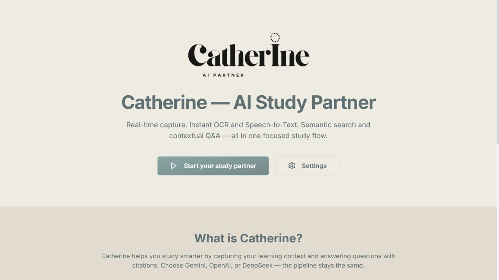
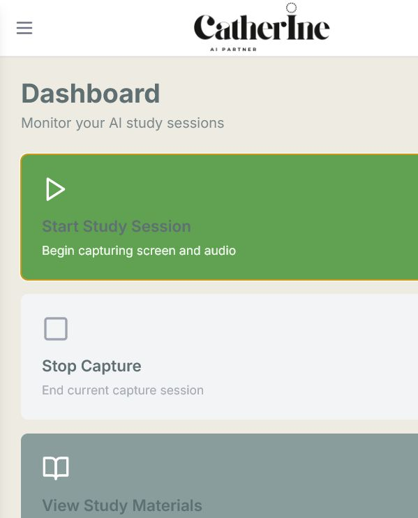
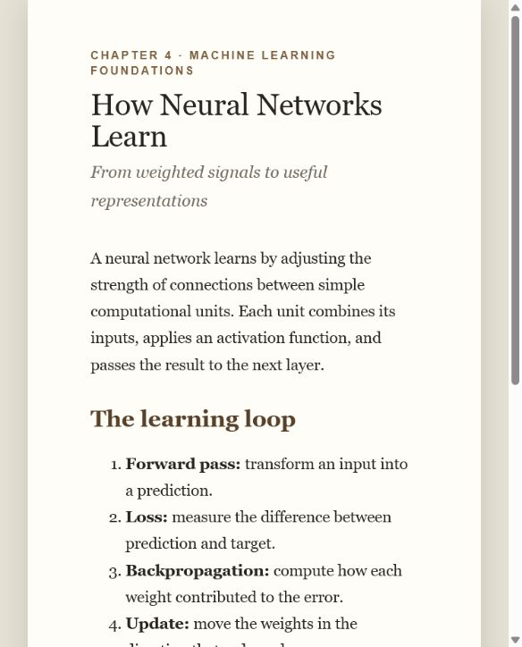
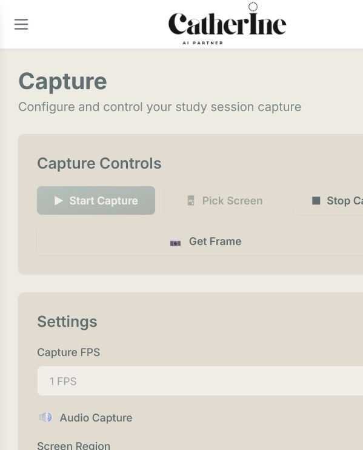
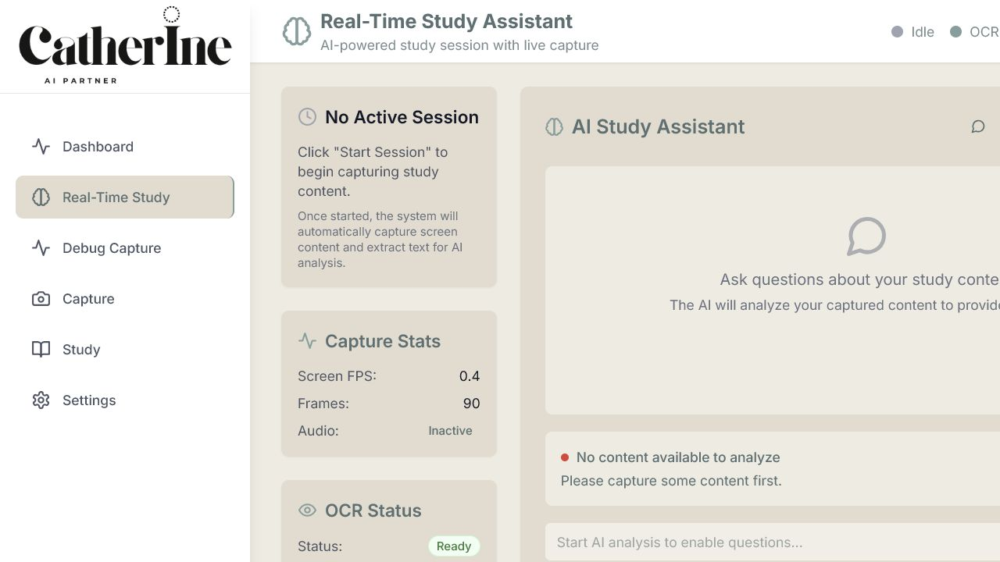
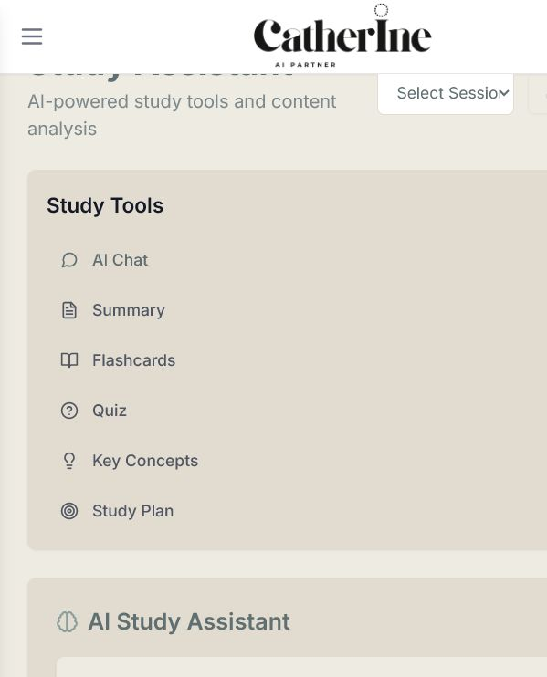
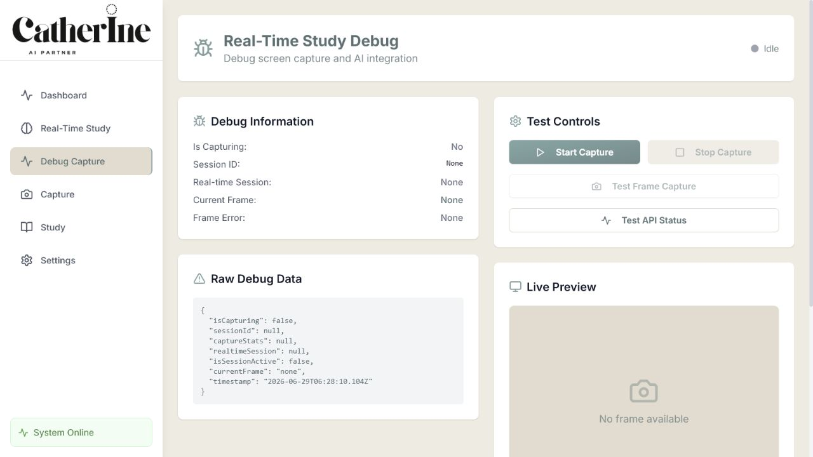
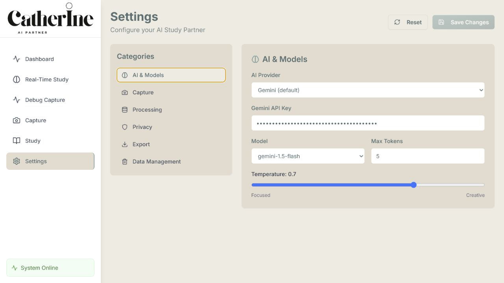
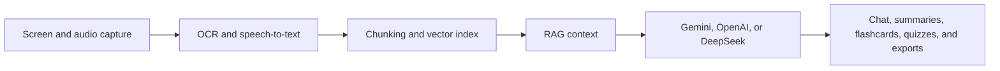

# Catherine — AI Study Partner

Catherine is a multimodal study companion that captures learning material, extracts useful context with OCR and speech-to-text, and turns it into summaries, answers, flashcards, quizzes, key concepts, and study plans.



## Highlights

- Real-time screen capture with configurable frame rate and monitor selection
- OCR and speech-to-text processing for slides, notes, books, and lectures
- Context-aware AI assistance through Gemini, OpenAI, or DeepSeek
- Session summaries, flashcards, quizzes, key concepts, and study plans
- Semantic search backed by a local vector database
- Anki, CSV, PDF, and JSON-oriented export workflows
- Local, hybrid, and cloud privacy modes

## Product tour

### Dashboard

Start a study session, monitor capture activity, and review high-level study progress from one place.



### Capture a study source

Catherine can monitor material such as this textbook-style neural-network lesson, then expose capture controls and session statistics inside the app.

| Study material | Capture workspace |
| --- | --- |
|  |  |

### Real-time study

The real-time workspace combines capture state, OCR readiness, performance controls, provider selection, and AI study tools.



### AI study assistant

Use one workspace for contextual chat, summaries, flashcards, quizzes, concept extraction, and study-plan generation.



### Debugging and configuration

The debug workspace makes capture state and API health visible. Settings cover AI providers, capture, processing, privacy, exports, and local data management.

| Capture diagnostics | Application settings |
| --- | --- |
|  |  |

## Architecture



The project is split into:

- `frontend/` — React, TypeScript, and Tailwind CSS interface
- `backend/` — FastAPI application and REST endpoints
- `backend/app/capture/` — screen, audio, and real-time capture
- `backend/app/processing/` — OCR and speech processing
- `backend/app/ai/` — provider integrations and unified LLM service
- `backend/app/database/` — vector storage and retrieval
- `backend/app/export/` — study-material exporters

## Quick start

### Prerequisites

- Python 3.11 recommended
- Node.js 18+
- Tesseract OCR for text extraction
- FFmpeg for audio processing

### Install

```bash
git clone https://github.com/georgeemiL787/Cath_ai_study_partner.git
cd Cath_ai_study_partner

python -m venv .venv
```

Activate the virtual environment:

```bash
# Windows PowerShell
.\.venv\Scripts\Activate.ps1

# macOS / Linux
source .venv/bin/activate
```

Install the backend and frontend dependencies:

```bash
python -m pip install -r requirements_python.txt
npm install
npm --prefix frontend install
```

### Configure

Copy the example environment file and add at least one supported AI provider key:

```bash
# Windows
copy env.example .env

# macOS / Linux
cp env.example .env
```

Common settings include `GEMINI_API_KEY`, `OPENAI_API_KEY`, `OCR_ENGINE`, `TESSERACT_PATH`, `STT_ENGINE`, `WHISPER_MODEL`, and `PRIVACY_MODE`.

### Run

```bash
npm run dev
```

On Windows systems that block PowerShell npm scripts, use:

```powershell
npm.cmd run dev
```

- Web interface: [http://localhost:3000](http://localhost:3000)
- API documentation: [http://localhost:8000/docs](http://localhost:8000/docs)
- API health check: [http://localhost:8000/api/status](http://localhost:8000/api/status)

## Development

```bash
# Backend tests
pytest backend/tests/

# Frontend tests
npm --prefix frontend test

# Production frontend build
npm --prefix frontend run build
```

## Privacy

Catherine exposes local, hybrid, and cloud-oriented processing settings. Screen and audio capture remain under the user's control, and provider API keys are stored through the local environment/settings workflow. Review your selected provider and privacy mode before capturing sensitive material.

## License

This project is released under the MIT license.

---

Built for focused, active learning.
